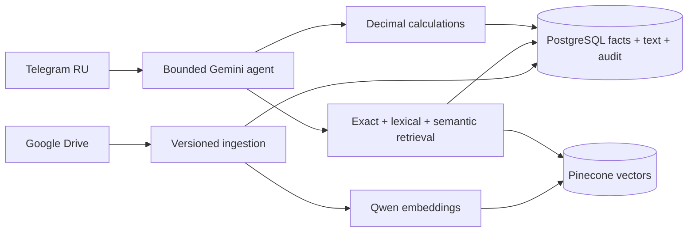

# German Accounting RAG Bot

Production-oriented Telegram RAG system for German accounting, banking, tax and administrative
documents stored in Google Drive. Users ask in Russian; the system retrieves original German
evidence, stores facts in PostgreSQL and performs money calculations in deterministic Python.

> This software prepares evidence and draft calculations. It does not provide legal/tax advice,
> invent legal rules, approve declarations or file anything with authorities.

## Core guarantees

- Google Drive stays the source of original files.
- PostgreSQL stores full normalized chunks, transactions, version state, calculations and audit.
- Pinecone stores external Qwen vectors and compact metadata, not full documents.
- Gemini receives only selected evidence, never the whole Drive, and cannot execute document text.
- All monetary arithmetic uses `Decimal`; Gemini is not used as a calculator.
- A failed reindex does not replace the currently active document version.
- OCR is explicit PDF fallback. Empty scanned PDFs are never silently indexed.
- Tenant ID is enforced by database queries and Pinecone namespaces/filters.

See [architecture](docs/architecture.md), [data model](docs/data-model.md),
[privacy](docs/privacy.md) and [assumptions](docs/project-assumptions.md).

## Architecture



## 1. Prerequisites

- Docker Engine with Compose, or Python 3.12 plus PostgreSQL 17 and Redis 7.
- A Telegram bot token from [BotFather](https://t.me/BotFather).
- Your numeric Telegram user ID (for example via `@userinfobot`).
- A Google Cloud project with Google Drive API enabled.
- Google OAuth Desktop credentials, or a read-only service account shared onto the Drive root folder.
- A Gemini Developer API key if external answer generation is enabled.
- A Pinecone dense index with dimension `1024` and cosine metric.
- Enough RAM/disk for local `Qwen/Qwen3-Embedding-0.6B`, or an HTTP embedding endpoint.

The observed project Drive root is
`https://drive.google.com/drive/folders/1Iomj78CcnEYGU--5YMQQtjaTRVdxsHCM`. Configure its folder ID
in the environment; it is intentionally not embedded in business code.

## 2. Google Drive setup

1. Create or select a Google Cloud project and enable **Google Drive API**.
2. Recommended for local use: configure Google Auth Platform, create an OAuth client with
   application type **Desktop app**, and save its downloaded JSON as
   `credentials/google-oauth-client.json`.
3. Set `GOOGLE_AUTH_MODE=oauth2`. The first CLI command opens a browser for consent and stores the
   refreshable credential in `credentials/google-oauth-token.json`; both files are gitignored.
4. If organization policy permits service-account keys, `GOOGLE_AUTH_MODE=service_account` remains
   available with `credentials/google-service-account.json`. Share the target folder with that
   account as **Viewer**.
5. Set `GOOGLE_DRIVE_ROOT_FOLDER_ID=1Iomj78CcnEYGU--5YMQQtjaTRVdxsHCM` in `.env`. A full Drive folder
   URL is also accepted and normalized automatically.

For Docker, complete the initial OAuth browser login locally first. Compose mounts the same
`credentials` directory read-only at `/run/secrets`, where the worker can refresh the saved token.

The adapter walks folders recursively and persists the full logical path. It exports Google Docs to
DOCX and Google Sheets to XLSX. The incremental adapter supports Drive `startPageToken` and
`changes.list`; production scheduling must persist the resulting page token in `sync_jobs`.

## 3. Telegram setup

1. Create a bot with BotFather and set `TELEGRAM_BOT_TOKEN`.
2. To discover your ID without a third-party bot, initially leave `TELEGRAM_ALLOWED_USER_IDS` and
   `TELEGRAM_ADMIN_USER_IDS` empty, start the bot, and send `/whoami`.
3. Put comma-separated **numeric Telegram user IDs** in `TELEGRAM_ALLOWED_USER_IDS` (for example,
   `123456789`). Telegram usernames such as `@example` are intentionally unsupported because they
   can be changed or reassigned.
4. Put numeric administrator IDs in `TELEGRAM_ADMIN_USER_IDS`.
5. Set `TELEGRAM_DEFAULT_TENANT_ID` to the tenant UUID, or leave it empty until the tenant exists.
6. Viewer/accountant/admin roles also exist in PostgreSQL. Complete tenant/user mapping before
   exposing the bot; until then tenant-specific handlers deliberately refuse to guess a tenant.

## 4. Pinecone and Qwen

Create a **dense** Pinecone index manually:

- dimension: `1024`
- metric: `cosine`
- region/cloud: your selected serverless region

Set `PINECONE_API_KEY`, `PINECONE_INDEX`, and preferably `PINECONE_HOST`. Run:

```bash
python -m app.cli verify-index
```

The app aborts on a dimension mismatch and never recreates a production index. Local embeddings are
optional so normal CI does not download Torch or model weights:

```bash
pip install -e ".[embeddings]"
```

For an internal embedding service set `EMBEDDING_PROVIDER=http`, `EMBEDDING_HTTP_URL`, and its key.

## 5. Gemini

Set `GEMINI_API_KEY` and a model available to your account in `GEMINI_MODEL`. The adapter uses the
current official `google-genai` async client and Pydantic structured output. Set
`AI_EXTERNAL_PROCESSING_ENABLED=false` to prevent any document evidence from leaving the local
pipeline. Parsing, deterministic extraction and indexing remain available.

## 6. Configure and start

```bash
cp .env.example .env
# edit .env; never commit it
docker compose up --build
```

Services: `api`, `bot`, `worker`, `postgres`, `redis`; the one-shot `migrate` service applies Alembic.
Local Python commands connect to the Compose PostgreSQL instance through `localhost:5433`, avoiding
collisions with a system PostgreSQL on the default port. Containers continue to use `postgres:5432`.
For Tesseract (`deu+eng`) use the optional image/profile:

```bash
docker compose --profile ocr up --build
```

Local development:

```bash
python -m venv .venv
.venv/Scripts/activate      # Windows PowerShell
python -m pip install -e ".[dev]"
alembic upgrade head
uvicorn app.main:app --reload
```

OpenAPI is at `http://localhost:8000/docs`. Protected `/api/v1/*` endpoints require `X-API-Key`.

## 7. Safe first ingestion

Never start with a full external write. Follow this order:

```bash
# 1. Inventory, PDF text-layer/OCR detection, no embeddings
python -m app.cli estimate-index

# Faster metadata-only approximation when needed
python -m app.cli estimate-index --metadata-only

# 2. Parse a 20-document pilot; no DB/Pinecone writes
python -m app.cli sync --limit 20

# 3. After inspecting output, write the 20-document pilot
python -m app.cli sync --limit 20 --commit --confirm

# 4. Only after review: set INITIAL_SYNC_DRY_RUN=false, then
python -m app.cli sync --full --commit --confirm

# Save a Changes token after the full baseline
python -m app.cli drive-token

# Later, use that persisted token for incremental updates/deletions
python -m app.cli sync --page-token <token> --commit --confirm
```

`make estimate-index`, `make sync-sample`, and `make sync-full` are aliases. A full sync can resume by
re-running: source IDs and content-derived version IDs are stable and upserts are idempotent.

The estimator reports file/MIME/folder/year counts, source size, PDFs, text-layer/OCR counts,
estimated chunks/vectors, vector and metadata bytes, projected storage and `SAFE`, `WARNING`, or
`LIMIT_EXCEEDED` against `PINECONE_STORAGE_WARNING_MB`. It never creates embeddings.

## 8. Telegram commands

`/start`, `/help`, `/sync`, `/sync_status`, `/documents`, `/document`, `/search`, `/ask`,
`/transactions`, `/unmatched`, `/conflicts`, `/calculations`, `/audit`, `/settings`, `/health`.

Full Drive sync is never executed in a Telegram handler. `/sync` is admin-only and queues a dry run.
The remaining tenant-scoped bot commands intentionally require deployment-specific Telegram-user to
tenant mapping; the API endpoints and DB role model are already present.

## 9. API endpoints

- `GET /health`, `/ready`, `/metrics`
- `POST /api/v1/sync`, `GET /api/v1/sync/{job_id}`
- `GET /api/v1/documents`, `GET /api/v1/documents/{id}`
- `POST /api/v1/search`, `POST /api/v1/ask`
- `GET /api/v1/transactions`
- `GET /api/v1/reconciliation/unmatched|conflicts`
- `POST /api/v1/calculations/depreciation`
- `POST /api/v1/calculations/utility-allocation`
- `GET /api/v1/audit`

## 10. Parsing and retrieval

Supported primary types are PDF, Google Docs/Sheets exports, DOCX, XLSX, CSV, TXT and Markdown.
Standalone images/audio/video are intentionally rejected. Parsers preserve pages, sheets and rows.
`GermanBankStatementParser` handles German dates, line wrapping, references and trailing-minus debit
amounts such as `299,85-`.

Retrieval combines:

1. exact identifier lookup (IBAN/reference/invoice-like values);
2. PostgreSQL German full-text search (ILIKE fallback only in SQLite tests);
3. Qwen/Pinecone semantic search;
4. transparent reciprocal-rank fusion and deduplication;
5. authoritative chunk hydration from PostgreSQL.

Russian queries are expanded with German accounting terms only for retrieval. Expansion terms are
never treated as evidence.

## 11. Tests and quality

```bash
ruff check .
mypy app
pytest -m "not external" --cov-fail-under=80
pytest -m external       # only with explicit real credentials
alembic upgrade head
alembic check
docker build .
```

Cross-lingual examples live in `tests/evals/german_russian_rag.jsonl`; run
`python scripts/evaluate_retrieval.py` for deterministic baseline Recall@5/MRR. External Qwen,
Pinecone, Drive and Gemini tests are excluded from ordinary CI.

## 12. Operations

- Back up PostgreSQL with encrypted `pg_dump`; configure Drive retention separately.
- Redis is a queue/backend, not the source of record.
- Keep Pinecone index name/version in deployment change control. A model/dimension change requires a
  new controlled reindex; do not mutate the existing index in place.
- Use `/ready` for dependency readiness and `/health` only for process liveness.
- Prometheus metrics are exposed at `/metrics`; logs are structured and must remain PII-safe.
- To delete data, mark the document deleted, remove its active-version vectors, retain the audit row,
  and follow the applicable retention policy. Do not delete directly from Pinecone alone.

## Known limitations before production

- Telegram tenant mapping and all command result renderers need organization-specific policy wiring.
- The Celery task currently enforces the safe queue boundary; deployment must wire it to the async
  ingestion service and persist progress/page tokens.
- Bank layouts vary. Add anonymized golden fixtures for every bank/template before trusting extraction.
- Table extraction for complex PDFs and Gemini structured document extraction need template-specific
  validation and human review.
- The initial Alembic baseline creates the complete current metadata; future schema changes must use
  explicit immutable migrations.
- Legal rules are deliberately empty until sourced and manually approved.
- Production requires encrypted backups, secret manager integration, TLS, network policies, retention,
  alerting and a DPIA/security review appropriate to the organization.
