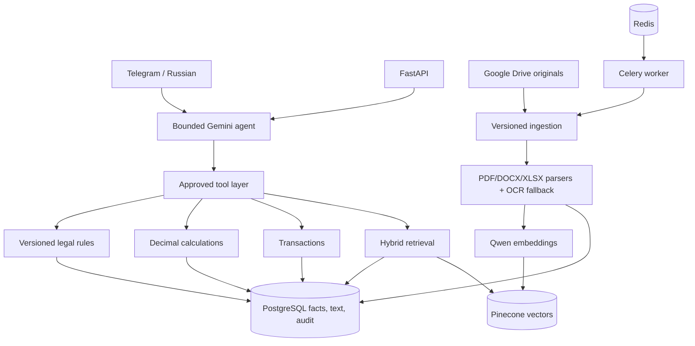
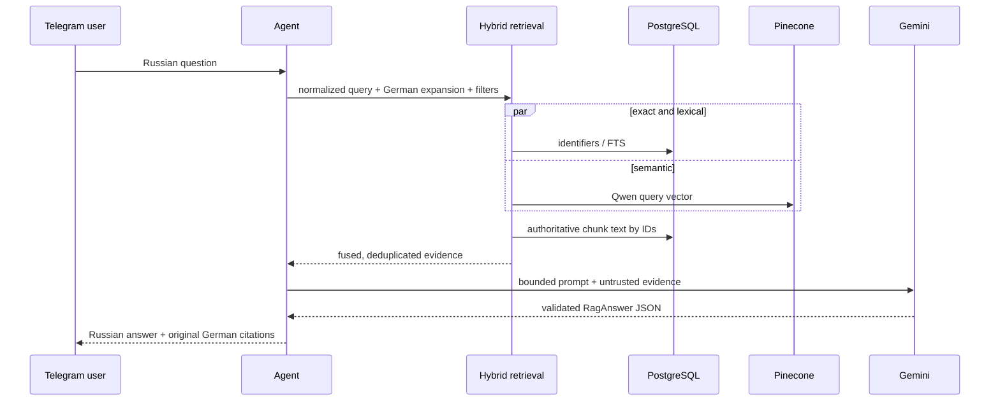
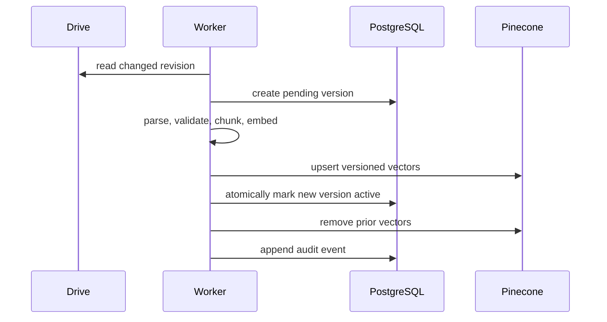
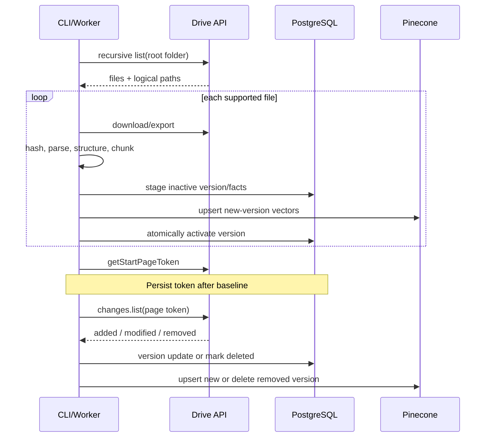
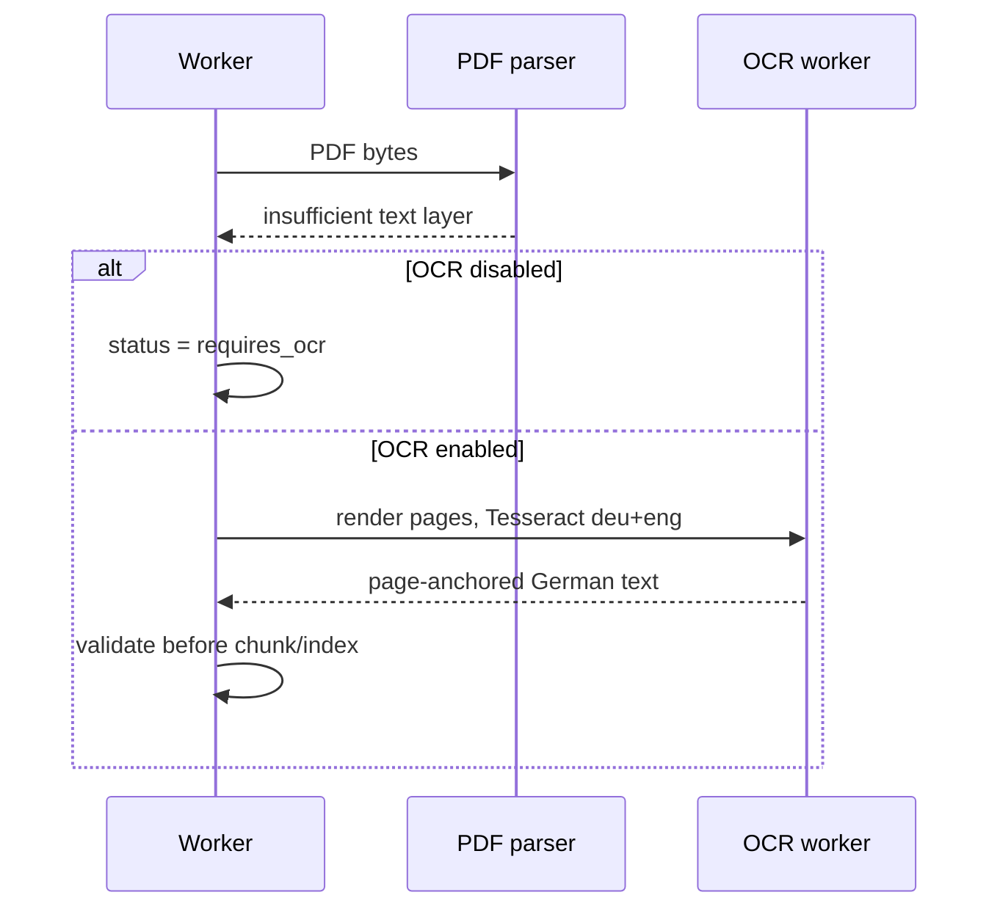

# Architecture



## Trust boundaries

Drive documents are untrusted evidence. Their text is delimited before it reaches Gemini. The model
has no SQL, filesystem or unrestricted vector-store tool. Tenant filters are mandatory at repository
and vector namespace boundaries. A failed reindex leaves the prior active version untouched.

## RAG question sequence



## Safe document update sequence



## First and incremental synchronization



## Scanned PDF



## Reconciliation, calculation and agent tools

```mermaid
sequenceDiagram
  participant U as User
  participant A as Bounded agent
  participant T as Approved tools
  participant P as PostgreSQL
  U->>A: financial question
  A->>T: search_bank_transactions
  T->>P: tenant-scoped records
  P-->>T: Decimal facts + source anchors
  alt deterministic calculation
    A->>T: calculate_depreciation / utility allocation
    T->>T: Decimal formula and rounding
  else reconciliation
    A->>T: score reconciliation candidate
    T->>T: weighted deterministic components
  end
  T-->>A: result + evidence + reasons
  A-->>U: Russian explanation, German citations
  Note over A,T: Tool count and timeout are bounded; approvals remain human-only
```
